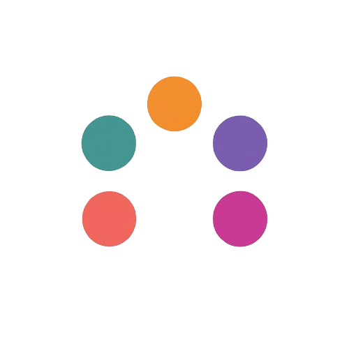
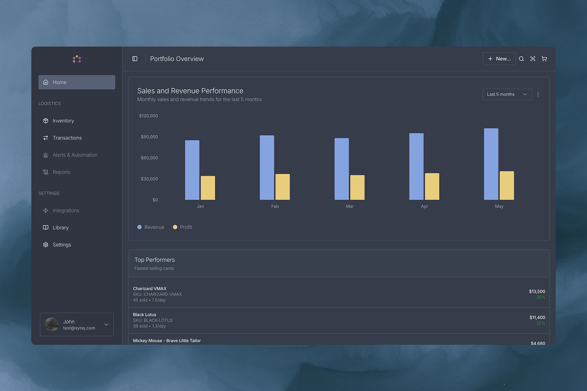

<div align="center">
  
  <p>Inventory management for card game stores.</p>
</div>
<br />

  

## About

The card market remains large and active, with millions of transactions each month on TCGPlayer (US) and Cardmarket (Europe). This market is heavily supported by local shops who often rely on spreadsheets, manual processes. Many generic inventory systems don't adequately address unique card shop needs.

This software aims to make business owners life and operations easier. The project is currently in development.

## Core Features

### Inventory Management
The inventory view displays card collections with stock levels, conditions, and values. Features include real-time stock tracking, physical location tracking, condition and grading support, and value estimation.

### Transactions
The transactions view shows buying and selling activities with fees, profits, and transaction history. Includes buy/sell tracking, grading submissions, damage and loss tracking, returns and refunds, profit analysis, and transaction history.

### Card Game Data Access
The library view provides access to card databases for multiple card games. Users can import card data, track collections, and create custom libraries for specific product groups. Features include adding existing inventories from library, creating custom product groups, and complete card data and pricing.

## Open Source

Synq is open source. You can self-host the platform on your own servers, giving you complete control over your data and infrastructure.

## Tech Stack

- **Frontend:**

  - Next.js
  - React
  - TypeScript
  - Tailwind CSS
  - Shadcn UI components

- **Backend:**

  - Next.js API Routes
  - Supabase for authentication and database
  - Resend for email delivery

- **Development:**
  - Turborepo for monorepo management
  - ESLint and Prettier for code quality
  - TypeScript for type safety

## Project Structure

```
synq-collectibles/
├── apps/                    # Applications
│   ├── web/                 # Next.js web application (dashboard)
│   └── landing/             # Next.js landing page
├── packages/                # Shared packages
│   ├── ui/                  # Shared UI components
│   ├── supabase/            # Supabase client and services
│   ├── stripe-config/       # Stripe configuration
│   ├── eslint-config/       # Shared ESLint configuration
│   └── typescript-config/   # Shared TypeScript configuration
├── infra/                   # Infrastructure
│   └── supabase/            # Supabase migrations and functions
└── .github/                 # GitHub workflows and templates
```

## Getting Started

### Prerequisites

- Node.js 20.9.0 or later
- Yarn 1.22.19 or later
- Docker Desktop installed and running
- Supabase CLI installed (see [official documentation](https://supabase.com/docs/guides/local-development/cli/getting-started?queryGroups=platform&platform=macos) for installation methods)

### Installation

1. Clone the repository:

   ```bash
   git clone git@github.com:synqcloud/synq.git
   cd synq
   ```

2. Install dependencies:

   ```bash
   yarn install
   ```

3. Start Local Supabase:

   ```bash
   cd infra && supabase start
   ```

   This will start the local Supabase instance and output your API credentials.

4. Set up environment variables:

   ```bash
   cp /.env.example .env.local
   ```

   Edit `.env.local` with the values from the Supabase start output:

   - `NEXT_PUBLIC_SUPABASE_URL`: http://localhost:54321
   - `NEXT_PUBLIC_SUPABASE_ANON_KEY`: Your anon key from the Supabase start output
   - `STRIPE_SECRET_KEY`: Your Stripe secret key (for subscription features)

5. Reset the database (if needed):

   ```bash
   cd infra && supabase db reset
   ```

   This will run migrations and seed the database with test data.

6. Start the development server:
   ```bash
   yarn dev
   ```

The applications will be available at:

- Web Application (Dashboard): http://localhost:3000
- Landing Page: http://localhost:3001
- Supabase Dashboard: http://localhost:54323
- Auth Emails: http://localhost:54324

### Development Scripts
Run from root:
- `yarn dev` - Start development server with Turbopack
- `yarn dev:web` - Start the web platform development server with Turbopack
- `yarn dev:landing` - Start the landing page development server with Turbopack
- `yarn build` - Build the application
- `yarn lint` - Run ESLint
- `yarn format` - Format code with Prettier
- `yarn generate-types` - Generate Supabase database types

### Troubleshooting

If you encounter issues:

1. Ensure Docker Desktop is running
2. Check Supabase status:
   ```bash
   cd infra && supabase status
   ```
3. Restart Supabase if needed:
   ```bash
   cd infra && supabase start
   ```
4. Reset the database:
   ```bash
   cd infra && supabase db reset
   ```
5. Verify your environment variables in `.env.local`

## Contributing

Feel free to open issues or submit pull requests if you have suggestions for improvements.

## License

This project is licensed under the AGPL-3.0 for non-commercial use.
